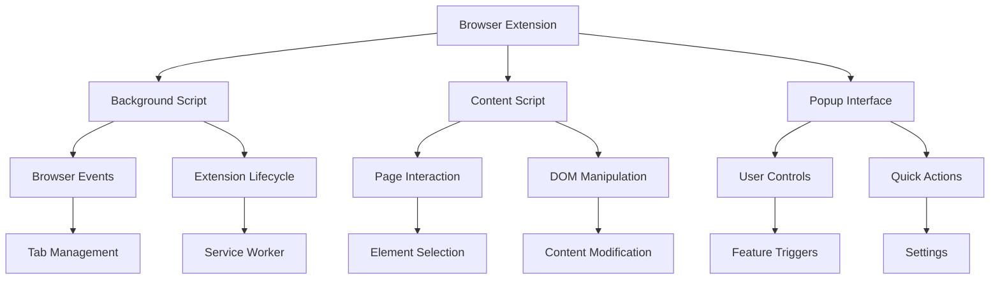

# Tone Sync 🎵  
*A Google Chrome Extension for synchronized tone-based interactions*

## 📌 Overview
Tone Sync is a **Google built-in browser extension** designed to enhance web interactions by synchronizing tone-based features across pages. It leverages background scripts, content scripts, and a popup UI to provide seamless control and integration.

---

## 🚀 Features
- **Background Script**: Manages extension lifecycle and browser events.  
- **Content Script**: Interacts with web page content and DOM manipulation.  
- **Popup UI**: Provides user-facing controls for quick actions and settings.  
- **Manifest**: Defines extension configuration, permissions, and metadata.  
- **Custom Styling**: Includes `style.css` for UI customization.  

---

## 📂 Project Structure
```text
Tone_sync/
│
├── manifest.json       # Extension manifest configuration
├── background.js       # Handles browser events & lifecycle
├── content.js          # Page interaction & DOM manipulation
├── popup.html          # Popup UI structure
├── popup.js            # Popup functionality & logic
├── style.css           # Styling for popup and UI
```

---

## 🛠️ Installation
1. Clone the repository:
   ```bash
   git clone https://github.com/Mamathagorla/Tone_sync.git
   ```
2. Open **Google Chrome** and navigate to:
   ```
   chrome://extensions/
   ```
3. Enable **Developer Mode** (top-right toggle).
4. Click **Load unpacked** and select the `Tone_sync` folder.
5. The extension will now appear in your browser toolbar.

---

## 📊 Architecture


---

## 📑 Component Table
| Component        | Purpose                                   | File(s)                  |
|------------------|-------------------------------------------|--------------------------|
| Background Script| Handles extension lifecycle & browser events | background.js            |
| Content Script   | Interacts with web page content           | content.js               |
| Popup UI         | Provides user interface for extension controls | popup.html, popup.js     |
| Manifest         | Defines extension configuration & permissions | manifest.json            |
| Styling          | Customizes popup and UI appearance        | style.css                |

---

## 🤝 Contributing
Contributions are welcome!  
- Fork the repo  
- Create a new branch (`feature-xyz`)  
- Commit changes with clear messages  
- Submit a pull request  

---

## 📜 License
This project is licensed under the **MIT License**. You are free to use, modify, and distribute it with attribution.
